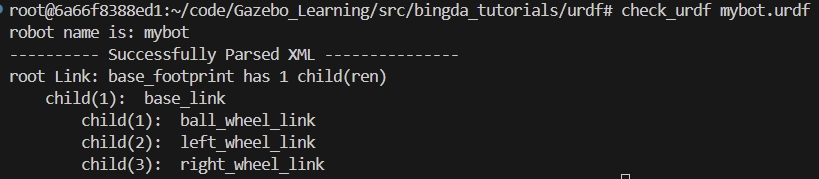

## Environment setup (x86)
- Docker pull
    - ` $ sudo docker pull nvidia/cuda:11.4.3-cudnn8-devel-ubuntu20.04`
- 启动镜像(docker可视化)
    - `xhost +local:root` # 出现`non-network local connections being added to access control list`说明执行成功
    - `$ sudo docker run --name gazebo_env -itd --volume="/tmp/.X11-unix:/tmp/.X11-unix:rw" -v /home/ntueee/yangjianbing:/root/code -p 2022:22 -e NVIDIA_DRIVER_CAPABILITIES=compute,utility --env="DISPLAY" --env="QT_X11_NO_MITSHM=1" --gpus all --shm-size="12g" --restart=always nvidia/cuda:11.4.3-cudnn8-devel-ubuntu20.04`
    - 注意：
        - 必须在host主机上先运行xhost +local:root
        - 必须在host主机上启动该镜像
        - 必须用sudo docker exec -it xxxx /bin/bash进入镜像

- Install dependence
    - apt update && apt install -y libsm6 libxext6
    - apt-get install -y libxrender-dev
    - apt-get install libglib2.0-0
    - pip install -r requirements.txt

- 测试可视化是否成功
    ```
    import cv2
    img = cv2.imread("/figures/gazebo_show.png")
    cv2.imshow("show", img)
    cv2.cv2.waitKey(30)
    ```

- Install ssh (Note that enter container first!)
    - `$ apt-get update`
    - `$ apt-get install vim`
    - `$ apt-get install openssh-server`
    - 设置root密码，后续登录会用到: `$ passwd`
    - 修改配置文件: `$ vim /etc/ssh/sshd_config`
        ``` 
        #PermitRootLogin prohibit-password
        PermitRootLogin yes
        UsePAM yes 修改为 no
        注释这一行PermitRootLogin prohibit-password
        添加一行PermitRootLogin yes
        UsePAM yes 修改为 no #禁用PAM
        ```
    - 重启ssh服务: `$ service ssh restart`
    - 添加开机启动
        - 新建`power_launch.sh`文件，放到根目录：`/root`下，`power_launch.sh`添加如下内容
            ```
            #!/bin/sh -e
            service ssh start &
            ```
        - 获取读写权限：`chmod 777 /root/power_launch.sh`
        - 编辑`~/.bashrc`: `vim ~/.bashrc`，在下面添加
            ```
            if [ -f /root/power_launch.sh ]; then
                    ./root/power_launch.sh
            fi
            ```
- Install [ROS](https://wiki.ros.org/noetic/Installation/Ubuntu)(ubuntu20.04) （注：ROS中包含了Gazebo）
    - rosbridge_suite
        ```
        apt-get update
        apt-get install ros-noetic-rosbridge-suite
        ```
    - [Gazebo](https://classic.gazebosim.org)

- 启动Gazebo

    `$ gazebo`
    - 如果显示失败，则需要重启镜像
    ```
    sudo docker stop gazebo_env
    sudo docker rm gazebo_env
    xhost +local:root
    sudo docker run --name gazebo_env -itd --volume="/tmp/.X11-unix:/tmp/.X11-unix:rw" -v /home/ntueee/yangjianbing:/root/code -p 2022:22 -e NVIDIA_DRIVER_CAPABILITIES=compute,utility --env="DISPLAY" --env="QT_X11_NO_MITSHM=1" --gpus all --shm-size="12g" --restart=always nvidia-cuda-11.4.3-cudnn8-devel-ubuntu20.04-ros1:v1.0
    sudo docker exec -it gazebo_env /bin/bash
    ```

## 一、`robot_navigation`，参考[视频](https://www.bilibili.com/video/BV143411C75B?p=2&vd_source=42f1e486842e9add1356fbbd0f4159f3)
- 编译
    ```
    cd Gazebo_Learning
    catkin_make --pkg robot_navigation
    ```
- 安装相关依赖
    ```
    apt-get install ros-noetic-amcl ros-noetic-move-base ros-noetic-slam-gmapping ros-noetic-slam-karto  ros-noetic-dwa-local-planner ros-noetic-teb-local-planner ros-noetic-map-server ros-noetic-hector-slam liburdfdom-tools
    ```

- 下载[Gazebo](https://classic.gazebosim.org/tutorials?tut=model_structure&cat=build_robot)提供的模型库，并将其移动到`~/.gazebo`目录下，最后将`gazebo_models`改名为`models`，最后及得重启下`gazebo`就可以导入模型了
    ```
    cd Gazebo_Learning
    git clone https://github.com/osrf/gazebo_models
    mv gazebo_models/ ~/.gazebo/
    ```

## 二、world创建
- 保存的`.world`文件启动（存在pkg下的world文件夹中）
- 用`roslaunch`启动，启动脚本为[gazebo_world.launch](src/robot_navigation/launch/gazebo_world.launch)
    `roslaunch robot_navigation gazebo_world.launch` # 记得添加功能保的全局变量

## 三、urdf和机器人模型

在gazebo中，机器人是通过[urdf](https://wiki.ros.org/urdf)来描述的。

- 定义好`urdf`文件后，进行语法检查  
    - 进入`urdf`文件目录  
        `cd src/bingda_tutorials/urdf`
    - 检察
        `check_urdf mybot.urdf`  
            

- 可视化机器人urdf模型（rviz）
    `roslaunch bingda_tutorials display_robot.launch`

- 在环境中加载机器人
    `roslaunch bingda_tutorials gazebo_robot.launch`

## 四、传感器和执行器的安装
[xacro](https://wiki.ros.org/xacro)文件是对[urdf](https://wiki.ros.org/urdf)文件的补充，可以简化代码。

- 启动机器人仿真
    `roslaunch bingda_tutorials simulation_robot.launch`

## 五、从solidworks中创建URDF模型

[SolidWorks to URDF Exporter](https://wiki.ros.org/sw_urdf_exporter)


