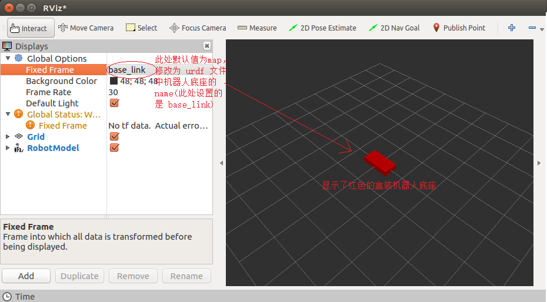

# Environment setup (x86)
- Docker pull
    - ` $ sudo docker pull nvidia/cuda:11.4.3-cudnn8-devel-ubuntu20.04`
- 启动镜像(docker可视化)
    - `xhost +local:root` # 出现`non-network local connections being added to access control list`说明执行成功
    - `$ sudo docker run --name gazebo_env -itd --volume="/tmp/.X11-unix:/tmp/.X11-unix:rw" -v /home/ntueee/yangjianbing:/root/code -p 2022:22 -e NVIDIA_DRIVER_CAPABILITIES=compute,utility --env="DISPLAY" --env="QT_X11_NO_MITSHM=1" --gpus all --shm-size="12g" --restart=always nvidia/cuda:11.4.3-cudnn8-devel-ubuntu20.04`
    - 注意：
        - 必须在host主机上先运行xhost +local:root
        - 必须在host主机上启动该镜像
        - 必须用sudo docker exec -it xxxx /bin/bash进入镜像

- Install dependence
    - apt update && apt install -y libsm6 libxext6
    - apt-get install -y libxrender-dev
    - apt-get install libglib2.0-0
    - pip install -r requirements.txt

- 测试可视化是否成功
    ```
    import cv2
    img = cv2.imread("/figures/gazebo_show.png")
    cv2.imshow("show", img)
    cv2.cv2.waitKey(30)
    ```

- Install ssh (Note that enter container first!)
    - `$ apt-get update`
    - `$ apt-get install vim`
    - `$ apt-get install openssh-server`
    - 设置root密码，后续登录会用到: `$ passwd`
    - 修改配置文件: `$ vim /etc/ssh/sshd_config`
        ``` 
        #PermitRootLogin prohibit-password
        PermitRootLogin yes
        UsePAM yes 修改为 no
        注释这一行PermitRootLogin prohibit-password
        添加一行PermitRootLogin yes
        UsePAM yes 修改为 no #禁用PAM
        ```
    - 重启ssh服务: `$ service ssh restart`
    - 添加开机启动
        - 新建`power_launch.sh`文件，放到根目录：`/root`下，`power_launch.sh`添加如下内容
            ```
            #!/bin/sh -e
            service ssh start &
            ```
        - 获取读写权限：`chmod 777 /root/power_launch.sh`
        - 编辑`~/.bashrc`: `vim ~/.bashrc`，在下面添加
            ```
            if [ -f /root/power_launch.sh ]; then
                    ./root/power_launch.sh
            fi
            ```
- Install [ROS](https://wiki.ros.org/noetic/Installation/Ubuntu)(ubuntu20.04) （注：ROS中包含了Gazebo）（ROS1学习[教程](http://www.autolabor.com.cn/book/ROSTutorials/di-5-zhang-ji-qi-ren-dao-hang.html)）
    - rosbridge_suite
        ```
        apt-get update
        apt-get install ros-noetic-rosbridge-suite
        ```
    - [Gazebo](https://classic.gazebosim.org)

- 启动Gazebo

    `$ gazebo`
    - 如果显示失败，则需要重启镜像
    ```
    sudo docker stop gazebo_env
    sudo docker rm gazebo_env
    xhost +local:root
    sudo docker run --name gazebo_env -itd --volume="/tmp/.X11-unix:/tmp/.X11-unix:rw" -v /home/ntueee/yangjianbing:/root/code -p 2022:22 -e NVIDIA_DRIVER_CAPABILITIES=compute,utility --env="DISPLAY" --env="QT_X11_NO_MITSHM=1" --gpus all --shm-size="12g" --restart=always nvidia-cuda-11.4.3-cudnn8-devel-ubuntu20.04-ros1:v1.0
    sudo docker exec -it gazebo_env /bin/bash
    ```

# 一、Gazebo
- 安装相关依赖
    ```
    apt-get install ros-noetic-amcl ros-noetic-move-base ros-noetic-slam-gmapping ros-noetic-slam-karto  ros-noetic-dwa-local-planner ros-noetic-teb-local-planner ros-noetic-map-server ros-noetic-hector-slam liburdfdom-tools ros-noetic-tf2-tools
    ```
- 下载[Gazebo](https://classic.gazebosim.org/tutorials?tut=model_structure&cat=build_robot)提供的模型库，并将其移动到`~/.gazebo`目录下，最后将`gazebo_models`改名为`models`，最后及得重启下`gazebo`就可以导入模型了
    ```
    cd Gazebo_Learning
    git clone https://github.com/osrf/gazebo_models
    mv gazebo_models/ ~/.gazebo/
    ```

## 1.1 URDF集成Rviz基本流程
- 创建功能包

    ```
    cd xxx_ws/src
    catkin_create_pkg rviz_gazebo_learning urdf xacro tf2 tf2_ros tf2_geometry_msgs roscpp rospy std_msgs geometry_msgs
    ```

- 在`rviz_gazebo_learning`功能包下新建如下目录 
 
    `mkdir urdf meshes config launch`
    - `urdf`: 存储 urdf 文件的目录

    - `meshes`:机器人模型渲染文件(暂不使用)

    - `config`: 配置文件

    - `launch`: 存储 launch 启动文件  
    

### 1.1.1 创建[urdf](https://wiki.ros.org/urdf)文件
- `cd urdf`
- 编辑如下内容
    ```
    <robot name="mycar">
    <link name="base_link">
        <visual>
            <geometry>
                <box size="0.5 0.2 0.1" />
            </geometry>
        </visual>
    </link>
    </robot>
    ```

### 1.1.2 在launch文件中集成URDF与Rviz

- 在launch目录下，新建[launch](src/rviz_gazebo_learning/launch/rviz_urdf_launch.launch)文件，该 launch 文件需要启动 Rviz，并导入 urdf 文件，Rviz 启动后可以自动载入解析urdf文件，并显示机器人模型。在ROS中，可以将urdf文件的路径设置到参数服务器，使用的参数名是:`robot_description`,示例代码如下: 

    ```
    <launch>

        <!-- 设置参数 -->
        <param name="robot_description" textfile="$(find rviz_gazebo_learning)/urdf/rviz_urdf.urdf" />

        <!-- 启动 rviz -->
        <node pkg="rviz" type="rviz" name="rviz" />

    </launch>
    ```

### 1.1.3 在Rviz中显示机器人模型
- rviz 启动后，会发现并没有盒装的机器人模型，这是因为默认情况下没有添加机器人显示组件，需要手动添加，添加方式如下:




### 1.1.4 优化 rviz 启动

- 重复启动launch文件时，Rviz 之前的组件配置信息不会自动保存，需要重复执行步骤4的操作，为了方便使用，可以使用如下方式优化:

    - 首先，将当前配置保存进config目录
    
    - 然后，launch文件中 Rviz 的启动配置添加参数:args,值设置为-d 配置文件路径
    ```
    <launch>
        <param name="robot_description" textfile="$(find 包名)/urdf/urdf/urdf01_HelloWorld.urdf" />
        <node pkg="rviz" type="rviz" name="rviz" args="-d $(find 包名)/config/rviz/show_mycar.rviz" />
    </launch>

    ```


## 1.1 `robot_navigation`，参考[视频](https://www.bilibili.com/video/BV143411C75B?p=2&vd_source=42f1e486842e9add1356fbbd0f4159f3)
- 编译
    ```
    cd Gazebo_Learning
    catkin_make --pkg robot_navigation
    ```


## 1.2 world创建
- 保存的`.world`文件启动（存在pkg下的world文件夹中）
- 用`roslaunch`启动，启动脚本为[gazebo_world.launch](src/robot_navigation/launch/gazebo_world.launch)
    `roslaunch robot_navigation gazebo_world.launch` # 记得添加功能保的全局变量

## 1.3 urdf和机器人模型

在gazebo中，机器人是通过[urdf](https://wiki.ros.org/urdf)来描述的。

- 定义好`urdf`文件后，进行语法检查  
    - 进入`urdf`文件目录  
        `cd src/bingda_tutorials/urdf`
    - 检察
        `check_urdf mybot.urdf`  
            

- 可视化机器人urdf模型（rviz）
    `roslaunch bingda_tutorials display_robot.launch`

- 在环境中加载机器人
    `roslaunch bingda_tutorials gazebo_robot.launch`

## 1.4传感器和执行器的安装
[xacro](https://wiki.ros.org/xacro)文件是对[urdf](https://wiki.ros.org/urdf)文件的补充，可以简化代码。

- 启动机器人仿真
    `roslaunch bingda_tutorials simulation_robot.launch`

## 1.5 从solidworks中创建URDF模型

[SolidWorks to URDF Exporter](https://wiki.ros.org/sw_urdf_exporter)


# 二、TF坐标变化
## 2.1 静态坐标变换
    所谓静态坐标变换，是指两个坐标系之间的相对位置是固定的。
- 需求描述:

    现有一机器人模型，核心构成包含主体与雷达，各对应一坐标系，坐标系的原点分别位于主体与雷达的物理中心，已知雷达原点相对于主体原点位移关系如下: x 0.2 y 0.0 z 0.5。当前雷达检测到一障碍物，在雷达坐标系中障碍物的坐标为 (2.0 3.0 5.0),请问，该障碍物相对于主体的坐标是多少？

- 实现分析:

    - 坐标系相对关系，可以通过发布方发布

    - 订阅方，订阅到发布的坐标系相对关系，再传入坐标点信息(可以写死)，然后借助于 tf 实现坐标变换，并将结果输出

### 2.1.1 方案A:C++实现
- 创建功能包(创建项目功能包依赖于 tf2、tf2_ros、tf2_geometry_msgs、roscpp rospy std_msgs geometry_msgs)

    ```
    cd xxx_ws/src
    catkin_create_pkg tf_learning tf2 tf2_ros tf2_geometry_msgs roscpp rospy std_msgs geometry_msgs
    ```

- [tf2_static_brocast_publisher.cpp](src/tf_learning/src/tf2_static_brocast_publisher.cpp)

- [tf2_static_brocast_subsriber.cpp](src/tf_learning/src/tf2_static_brocast_subsriber.cpp)

- 在功能包`tf_learning`中的最下面加入
    ```
    add_executable(tf2_publisher src/tf2_publisher.cpp)
    add_dependencies(tf2_publisher ${${PROJECT_NAME}_EXPORTED_TARGETS} ${catkin_EXPORTED_TARGETS})
    target_link_libraries(tf2_publisher ${catkin_LIBRARIES})

    add_executable(tf2_subsriber src/tf2_subsriber.cpp)
    add_dependencies(tf2_subsriber ${${PROJECT_NAME}_EXPORTED_TARGETS} ${catkin_EXPORTED_TARGETS})
    target_link_libraries(tf2_subsriber ${catkin_LIBRARIES})
    ```

- 编译
    ```
    cd /root/code/Gazebo_Learning
    catkin_make --pkg tf_learning
    ```

### 2.1.2 方案B:python实现
- [tf2_static_brocast_publisher.py](src/tf_learning/src/tf2_static_brocast_publisher.py)
- [tf2_static_brocast_subsriber.py](src/tf_learning/src/tf2_static_brocast_subsriber.py)
- 要记得`chmod 777 xxxx.py`

## 2.2 动态坐标变换
    所谓动态坐标变换，是指两个坐标系之间的相对位置是变化的。

- 需求描述:

    启动 turtlesim_node,该节点中窗体有一个世界坐标系(左下角为坐标系原点)，乌龟是另一个坐标系，键盘控制乌龟运动，将两个坐标系的相对位置动态发布。

- 实现分析:

    - 乌龟本身不但可以看作坐标系，也是世界坐标系中的一个坐标点

    - 订阅 turtle1/pose,可以获取乌龟在世界坐标系的 x坐标、y坐标、偏移量以及线速度和角速度

    - 将 pose 信息转换成 坐标系相对信息并发布

- 实现流程:C++ 与 Python 实现流程一致

    - 新建功能包，添加依赖

    - 创建坐标相对关系发布方(同时需要订阅乌龟位姿信息)

    - 创建坐标相对关系订阅方

    - 执行

- 启动小乌龟节点与键盘控制节点
    - 小乌龟节点
    `rosrun turtlesim turtlesim_node`
    - 键盘控制
    `rosrun turtlesim turtle_teleop_key`

### 2.2.1 方案A: c++实现
- [tf2_dynamic_brocast_pulisher.cpp](src/tf_learning/src/tf2_dynamic_brocast_pulisher.cpp)
- [tf2_dynamic_brocast_subscriber.cpp](src/tf_learning/src/tf2_dynamic_brocast_subscriber.cpp)

### 2.2.2 方案B: python实现
- [tf2_dynamic_brocast_pulisher.py](src/tf_learning/src/tf2_dynamic_brocast_pulisher.py)
- [tf2_dynamic_brocast_subscriber.py](src/tf_learning/src/tf2_dynamic_brocast_subscriber.py)
- 要记得`chmod 777 xxxx.py`

## 3.1 多坐标变换

- 需求描述:

    现有坐标系统，父级坐标系统 world,下有两子级系统 son1，son2，son1 相对于 world，以及 son2 相对于 world 的关系是已知的，求 son1原点在 son2中的坐标，又已知在 son1中一点的坐标，要求求出该点在 son2 中的坐标

- 实现分析:

    - 首先，需要发布 son1 相对于 world，以及 son2 相对于 world 的坐标消息
    -然后，需要订阅坐标发布消息，并取出订阅的消息，借助于 tf2 实现 son1 和 son2 的转换
    - 最后，还要实现坐标点的转换

- 实现流程:C++ 与 Python 实现流程一致

    - 新建功能包，添加依赖

    - 创建坐标相对关系发布方(需要发布两个坐标相对关系)

    -创建坐标相对关系订阅方

### 3.1.1 方案
- 发布方
    ```
    <launch>
    <node pkg="tf2_ros" type="static_transform_publisher" name="son1" args="0.2 0.8 0.3 0 0 0 /world /son1" output="screen" />
    <node pkg="tf2_ros" type="static_transform_publisher" name="son2" args="0.5 0 0 0 0 0 /world /son2" output="screen" />
    </launch>
    ```
- son1和son2相对于world坐标发布
    'roslaunch src/tf_learning/launch/tf2_static_publisher.launch'
- 订阅方(c++)：[tf2_muti_transform_subscriber.cpp](src/tf_learning/src/tf2_muti_transform_subscriber.cpp)
- 订阅方(python)：[tf2_muti_transform_subscriber.py](src/tf_learning/src/tf2_muti_transform_subscriber.py)

## 4.1 多坐标变换
- 启动坐标系广播程序之后，运行如下命令:
    `rosrun tf2_tools view_frames.py`    
- 会产生类似于下面的日志信息:
    ```
    [INFO] [1592920556.827549]: Listening to tf data during 5 seconds...
    [INFO] [1592920561.841536]: Generating graph in frames.pdf file...
    ```
- 查看当前目录会生成一个`frames.pdf`文件